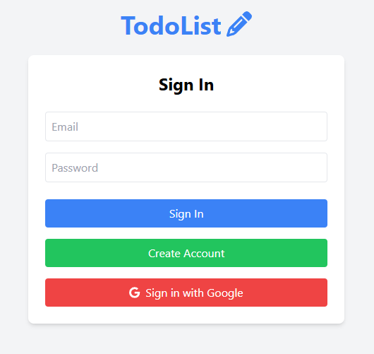
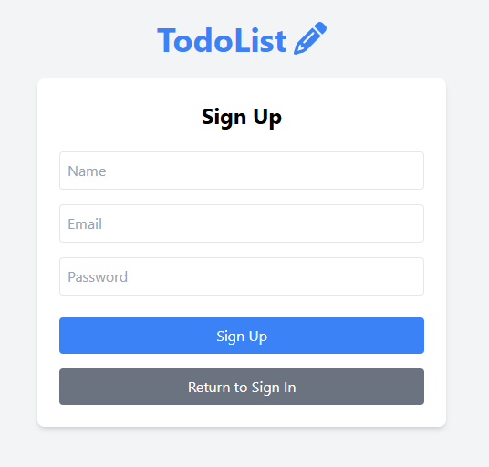
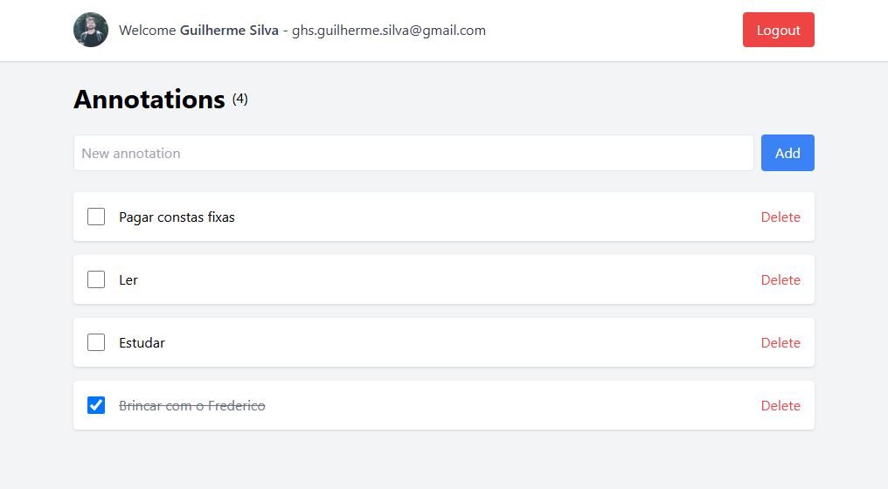
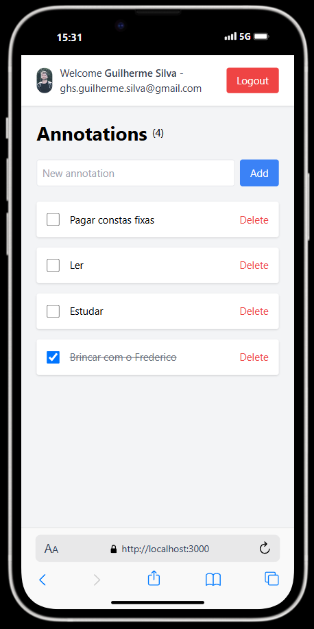

## 💻 Sobre o projeto

**TodoList-web** é uma aplicação desenvolvida em **React** que permite gerenciar seus afazeres de forma prática e intuitiva. Usuários autenticados podem inserir, editar, remover, detalhar e listar suas tarefas. A aplicação suporta autenticação tanto pela API própria quanto via conta Google.

<table align="center">
  <tr>
    <td align="center">
      <strong>Sign In</strong><br>
      
    </td>
    <td align="center">
      <strong>Sign Up</strong><br>
      
    </td>
  </tr>
  <tr>
    <td align="center">
      <strong>Annotations</strong><br>
      
    </td>
    <td align="center">
      <strong>Mobile</strong><br>
      
    </td>
  </tr>
</table>

---

## ⚙️ Funcionalidades

- ✅ Autenticação pela API própria;
- ✅ Autenticação via OAuth2 (Google);
- ✅ Verificação automática de token expirado;
- ✅ CRUD completo de tarefas por usuário.

---

## 🛠️ Como executar
### 1️⃣ Instale as dependências
No terminal, execute o seguinte comando para instalar todas as dependências necessárias:

```bash
npm install
```

### 2️⃣ Inicie o ambiente de desenvolvimento
Para rodar o projeto, use:
```bash
npm start
```

### 3️⃣ Acesse o portal
Após rodar o comando acima, o servidor estará disponível. Abra seu navegador e acesse:
```bash
http://localhost:3000
```

### 🧪 Testes
Para rodar os testes unitarios, use:
```bash
npm test
```

---

## 🛠 Tecnologias

As seguintes tecnologias foram utilizadas no desenvolvimento do projeto:

- **[React](https://react.dev/)** - Biblioteca para criação de interfaces de usuário;
- **[TailwindCss](https://tailwindcss.com/)** - Framework de estilização;
- **[Axios](https://axios-http.com/ptbr/docs/intro)** - Biblioteca para requisições HTTP.

---

## 👤 Autor
Feito com ❤️ por Guilherme Silva.  
📂 Confira mais projetos no meu GitHub: guilhermehenrysilva.